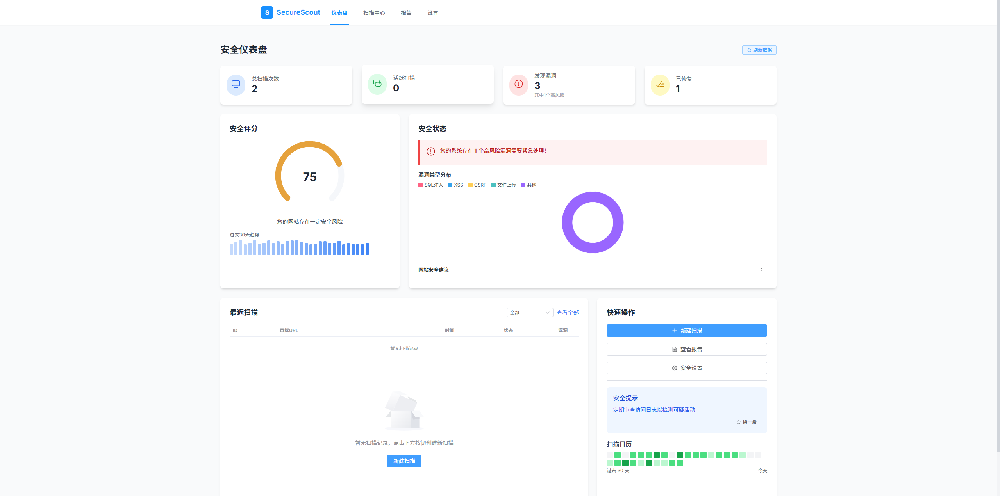

# 🛡️ SecureScout - Full-featured Web Security Scanning Platform



<div align="center">


[](https://fastapi.tiangolo.com/)
[](https://vuejs.org/)
[](https://element-plus.org/)
[](https://tailwindcss.com/)
[](https://www.chartjs.org/)

</div>

SecureScout is a powerful web security scanning tool that provides a beautiful light-themed frontend interface and robust backend scanning capabilities. It helps you detect common website security vulnerabilities, including SQL injection, XSS cross-site scripting, CSRF cross-site request forgery, file upload vulnerabilities, and more.

> 🔍 **Security Scanning · Vulnerability Analysis · Security Scoring · Remediation Suggestions**

## ✨ Features

| 🌟 Feature | 📝 Description |
|-----------|---------------|
| 🎨 **Beautiful User Interface** | Modern light theme design, data visualization dashboard, intuitive and easy to use |
| 🚀 **Powerful Scanning Engine** | Supports detection of common web vulnerabilities such as SQL injection, XSS, CSRF, file upload, etc. |
| ⚡ **Asynchronous Task Processing** | Supports parallel processing of multiple scan tasks for efficient scanning |
| 📊 **Detailed Reports** | Provides visual scan results and security suggestions, including vulnerability distribution, security scores, etc. |
| ⚙️ **Custom Configuration** | Allows users to customize scan parameters and rules for flexible adaptation to different scenarios |
| 📱 **Responsive Design** | Perfectly supports desktop and mobile, enabling security scanning anytime, anywhere |


## 🔧 Tech Stack

### 🖥️ Backend
- **FastAPI**: Fast and efficient API framework
- **aiohttp**: Asynchronous HTTP client/server
- **BeautifulSoup4**: HTML parsing library
- **Uvicorn**: ASGI server

### 🎨 Frontend
- **Vue 3**: Progressive JavaScript framework
- **Vite**: Modern frontend build tool
- **Element Plus**: UI component library
- **Tailwind CSS**: Utility-first CSS framework
- **Chart.js**: Data visualization library

## 🚀 Quick Start

### 📋 Requirements

- Python 3.8+
- Node.js 16+
- npm 8+

### 📥 Installation Steps

1. **Enter the project directory**

```bash
cd SecureScout
```

2. **Install backend dependencies**

```bash
cd backend
pip install -r requirements.txt
```

3. **Install frontend dependencies**

```bash
cd frontend
npm install
npm run dev
```

### ▶️ Run the Application

#### 🪟 Windows Users - One-click Start

Simply double-click the `start.bat` file in the project root directory to start both the frontend and backend services! The startup script will automatically:

- ✅ Check if environment dependencies are met
- ✅ Start the backend API service
- ✅ Start the frontend development server
- ✅ Open the application in your browser

#### 🖱️ Manual Start

1. **Start the backend service**

```bash
cd backend
python run.py
```

2. **Start the frontend service**

```bash
cd frontend
npm run dev
```

3. **Access the frontend page in your browser**

```
http://localhost:3000
```

## 📚 User Guide

### 🏠 Dashboard

The dashboard provides an overview of the system's overall security status:

- Security score and trend analysis
- Number and distribution of discovered vulnerabilities
- Recent scan records and results
- Security suggestions and quick action shortcuts

### 🔍 Scan Center

The scan center is the core area for security testing:

1. Enter the target website URL
2. Select scan mode (Quick/Standard/Deep)
3. Configure scan parameters (concurrency, timeout settings, etc.)
4. Start the scan and view progress in real time
5. View summary of results after scan completion

### 📊 Report Center

The report center provides detailed vulnerability analysis and security assessment:

- Vulnerability type distribution and risk levels
- Detailed vulnerability descriptions and reproduction steps
- Remediation suggestions and reference materials
- Report export function (PDF/HTML)

### ⚙️ Settings Center

The settings center allows customization of system configurations:

- Scan rule and parameter adjustments
- Vulnerability database updates
- Notification settings
- System preferences

